# depOS — Master Implementation Plan

## Resolved decisions

- **Canonical spec artifact:** `depos-pipeline.jsx` does not exist today. Phase 0 creates it from this markdown; the markdown remains the single source of truth until the JSX ships, and after that both must stay in sync per Section 11 / Section 12.
- **CFG/DFG language scope:** Python + JavaScript/TypeScript only. All other languages keep `cfg_available=False` and `dfg_available=False`. Group B/C detectors stay dark for those languages until a follow-up phase extends the semantic layer.
- **Phase 1 split (user-directed):** Phase 1a covers Python CFG + DFG + taint and is the exit criterion for the first working end-to-end run across all 11 stages. Phase 1b covers JS/TS CFG + DFG + taint and runs after Phases 2–7 have landed on Python. JS/TS does not block the first working end-to-end pipeline.
- **D1 — Schema migration strategy:** **Adapter-then-delete.** Add the new schemas alongside deprecated legacy fields, thread a translation adapter through `_wrap_candidate` / `make_candidate`, migrate the ~33 builtin detectors + 4 seed-family helpers one by one with `pytest` green throughout, and delete the adapter as the last commit of Phase 2.
- **D2 — `config.llm` namespace:** **Additive new namespace.** Introduce `config.llm` with `model`, `provider`, and related fields. Keep `config.reasoner` as a deprecated alias that reads from `config.llm` under the hood for exactly one release so existing `depos-intel analyze` invocations and customer CI files keep working. Rename-in-place is forbidden.
- **D3 — GraphCodeBERT deletion:** **Hard delete, no feature flag.** Remove `depos/analysis/graphcodebert.py`, its tests, the `config.ranker.use_graphcodebert` config field, and every reference in `docs/dataset-pipeline.md`. Ranking is `CandidateScore.composite`. Re-adding GraphCodeBERT later is a conscious decision, not a flag flip.
- **D4 — JS/TS CFG+DFG engine:** **Hand-rolled on tree-sitter nodes.** No Babel, Acorn, or TypeScript compiler API dependency. Build CFG and DFG directly over the tree-sitter trees already produced by `graphify/extract.py`, keeping everything inside the NetworkX boundary, consistent with the Python implementation.

## Preservation boundary (what stays, what changes)

- **Preserved:**
  - `networkx.DiGraph` as the graph type.
  - `depos.analysis.candidate_identifier.identify_candidates(...)` public signature and dedup/budget semantics (the payload schema inside `Candidate` changes; the function shape does not).
  - Every existing detector's **firing predicate** — only the emitted payload shape changes.
  - `graphify.extract` / `graphify.build.build_from_json` — untouched.
  - `dataset-pipeline` CLI usability throughout the refactor.
- **Replaced:**
  - `Candidate.priority_score: float` → `Candidate.score: CandidateScore` (Section 5.3).
  - `Candidate.extra: dict[str, Any]` → `Candidate.detector_payload: DetectorPayload` (Section 5.4).
  - `Candidate.seam_edges: list[EdgeId]` → `Candidate.seam_edges: list[SeamEdge]` (Section 5.2).
  - `depos.analysis.reasoning_engine._render_prompt` → new `BundlePrompter` over `GraphContextBundle`.
  - `depos.analysis.verifier.verify_all` → typed `VerifierRule` engine (Section 8).
  - GraphCodeBERT ranking → deterministic `CandidateScore.composite`.

## Architecture after refactor

```mermaid
flowchart LR
  ingest[Stage 1 AST ingest] --> build[Stage 2 Graph construction]
  build --> semantic[Phase 1: CFG + DFG + Taint + SeamEdge]
  semantic --> metrics["GraphMetrics (computed once)"]
  metrics --> manifest[Stage 3 Change manifest]
  manifest --> identify[Stage 4 identify_candidates]
  semantic --> identify
  identify --> detectors[Stage 5 Bug detectors]
  detectors --> bundle[Stage 6 GraphContextBundle]
  bundle --> rank[Stage 7 CandidateScore composite ranking]
  rank --> llm[Stage 8 BundlePrompter + LLM]
  llm --> verifier[Stage 9 Typed VerifierRule engine]
  verifier --> grayzone[Stage 10 Gray-Zone evaluator]
  grayzone --> output[Stage 11 JSON / SARIF / PR comment]
```

---

## Phase 0 — Canonical spec + run context scaffolding

**Prerequisites:** none. **Blocks:** every other phase.

- Create `depos-pipeline.jsx` as a React component rendering the 11-stage pipeline with the `CandidateScore` vector schema, graph-metrics-per-stage callouts, detector inventory (Groups A/B/C), and "vs CodeRabbit" positioning. Source of truth is this markdown; the JSX is the visual mirror.
- Add a `RunContext` dataclass in `depos/analysis/run_context.py` that carries `GraphMetrics`, the `SeamEdge` index, `cfg_available` / `dfg_available` / `taint_edges_available` flags, and the resolved change manifest. Thread it through `identify_candidates` and every detector's `run(graph, manifest, mode, config, ctx)` — `ctx` already exists at [depos/analysis/detectors/**init**.py](depos/analysis/detectors/__init__.py); extend it rather than replace it.
- Add `depos-pipeline` sync lint as `tests/test_jsx_spec_sync.py`. **Content-hash based, not timestamp- or existence-based** — a lint that passes because the JSX exists but is stale is strictly worse than no lint at all. Concrete requirements:
  - Maintain a manifest `tests/fixtures/jsx_spec_sync_manifest.json` mapping each tracked input to its last-committed SHA-256: the spec markdown (this plan file or its canonical successor), every file under `depos/analysis/` that implements a pipeline Stage, the detector registry, and `depos-pipeline.jsx` itself.
  - On each run the test recomputes SHA-256 over the current contents of every tracked file (read as bytes; no timestamp comparisons anywhere) and asserts each hash matches the manifest.
  - If any _input_ hash changed but `depos-pipeline.jsx`'s hash is unchanged, the test fails with a message naming the drifted input(s) and instructing the author to update the JSX and re-run `python tools/refresh_jsx_spec_sync.py` to regenerate the manifest.
  - If `depos-pipeline.jsx` changed, the regenerator script must be re-run so every hash (including the JSX's own) lands in the manifest atomically.
  - Forbidden implementations (explicit anti-patterns, call out in the test module docstring): `os.path.exists`, `os.path.getmtime`, `Path.stat().st_mtime`, "file touched in last commit" checks, `git log` timestamps, or any comparison that passes on an empty/unchanged JSX.
  - The regenerator lives at `tools/refresh_jsx_spec_sync.py`, is the only sanctioned way to update the manifest, and is itself covered by a smoke test.

**Acceptance:**

- `pytest tests/ -q` still green.
- `depos-pipeline.jsx` renders in a React sandbox (document the sandbox command in the module docstring).
- Every detector's `run()` sees a `RunContext` argument without needing to change yet (backward-compatible extension of `ctx`).
- **Sync-lint verification (blocking):** the reviewer must run three proof scenarios before Phase 0 is accepted:
  1. Modify any tracked Stage file without editing the JSX → `pytest tests/test_jsx_spec_sync.py` must **fail** and name the drifted file.
  2. `touch depos-pipeline.jsx` (bump mtime only, no content change) → the test must still **fail** — timestamp bumps do not satisfy the lint.
  3. Update the JSX content to reflect the change and re-run `tools/refresh_jsx_spec_sync.py` → the test must then **pass**.
- Any implementation that cannot demonstrate all three scenarios is rejected and sent back before Phase 0 exits.

---

## Phase 1a — Semantic layer (Python only; E2E exit criterion)

**Prerequisites:** Phase 0. **Blocks:** Group B / Group C detectors for Python, verifier correctness rules, taint pre-computation. Does **not** block Phases 2–7 from running against Python. **Exit criterion:** the full 11-stage pipeline runs end-to-end on a Python fixture with CFG, DFG, and taint edges materialized.

- **GraphMetrics:** implement Section 5.1's `compute_graph_metrics` in `depos/analysis/graph_metrics.py`. Compute once immediately after `graphify.build.build_from_json`; cache on `RunContext`. Fail loudly if any stage requests it without it being populated. Language-agnostic.
- **SeamEdge materialization:** implement Section 7.1 in `depos/analysis/seams.py`. Scan edges where `source_language != target_language`; classify per `SEAM_PATTERNS`; attach `SeamEdge` attributes on NetworkX edges and build the `seam_edge_index`. Language-agnostic.
- **Cross-language cycles:** implement Section 7.3 `detect_cross_language_cycles` using `nx.simple_cycles` on the call subgraph; return paths; stash on `GraphMetrics.cross_lang_cycles`. Language-agnostic.
- **Python CFG:** new module `depos/analysis/cfg/python.py`. Per function, build basic blocks + true/false branch edges + back edges + exception edges, stored as NetworkX edges with `type="cfg"`. Uses `ast` stdlib. Set `cfg_available=True` on the Python function's scope node.
- **Python DFG / def-use:** new module `depos/analysis/dfg/python.py`. Reaching definitions + use-before-def + def-after-use chains, stored as `type="dfg"` edges. Set `dfg_available=True` on the Python scope node.
- **Python taint pre-computation:** implement Section 7.2 in `depos/analysis/taint.py`, gated on `dfg_available` for Python scopes. Emits `TAINT` edges with the full source→sink path and `crosses_seam` / `seam_edges_crossed` metadata. Set `taint_edges_available=True` on Python scope nodes whose function was successfully analyzed.
- Wire all of the above into the post-build hook in [depos/cli/analyze.py](depos/cli/analyze.py) (the `_normalize_dataset_to_graph` path) and the main pipeline in [depos/analysis/pipeline.py](depos/analysis/pipeline.py).
- JS/TS and every other language keep `cfg_available=False`, `dfg_available=False`, `taint_edges_available=False` throughout Phase 1a — Group B/C detectors will simply not run for them, which is correct behavior, not a bug.

**Acceptance:**

- For the dataset pipeline fixtures, `GraphMetrics` is present on the run context before Stage 4 runs.
- Python fixtures show `cfg_available=True`, `dfg_available=True`, `taint_edges_available=True` on their function nodes.
- JS/TS and other-language fixtures show all three flags `False`.
- At least one seeded Python taint test (e.g., fixture where `http_param` reaches `db_query`) produces a `TAINT` edge with the expected chain.
- No regression in `pytest tests/ -q`.

---

## Phase 2 — Schema rewrite + detector migration (behind adapter)

**Prerequisites:** Phase 1a. **Blocks:** Phase 3.

- Add the new schemas in [depos/analysis/schemas.py](depos/analysis/schemas.py):
  - `SeamEdge` (Section 5.2), `CandidateScore` (Section 5.3), `DetectorPayload` (Section 5.4), revised `Candidate` (Section 5.5), `GraphContextBundle` (Section 5.6).
  - Keep the old `priority_score` / `extra` / `seam_edges: list[EdgeId]` fields as **deprecated** on `Candidate` for this phase only.
- Implement `compute_composite(score: CandidateScore) -> float` in `depos/analysis/scoring.py`, with weights read from `config.scoring.weights[analysis_mode]`. Defaults come from a single `WEIGHTS_DEFAULT` constant; do not spread them across detectors.
- Update `depos.analysis.candidate_identifier._*_candidates` helpers and [depos/analysis/detectors/builtin/common.py](depos/analysis/detectors/builtin/common.py) `make_candidate(...)`:
  - `make_candidate` now builds a `CandidateScore` from graph metrics + detector-supplied dimension overrides, and builds a `DetectorPayload`.
  - An **adapter layer** translates legacy `priority_score=...` / `extra=...` args used by the ~33 builtin detectors into the new shape during Phase 2. Adapter is deleted at end of Phase 2 once every call site is migrated.
- Update `_wrap_candidate` in [depos/analysis/detectors/**init**.py](depos/analysis/detectors/__init__.py) to populate `Candidate.detector_payload` directly (not `extra["detector"]`).
- Replace the sort key in `_prioritize` from `-priority_score` to `-score.composite`. Dedup key stays `(scope_id, seam_edges, diff_anchors)`.
- Update `_dedup` to hash on `SeamEdge.edge_id` now that `seam_edges` is typed.
- Update consumers in [depos/analysis/verifier.py](depos/analysis/verifier.py) and [depos/analysis/gray_zone_evaluator.py](depos/analysis/gray_zone_evaluator.py) to read `candidate.detector_payload` instead of `candidate.extra["detector"]`.

**Acceptance:**

- Every detector module under [depos/analysis/detectors/builtin/](depos/analysis/detectors/builtin) compiles and emits a fully populated `CandidateScore` + `DetectorPayload`.
- `candidate.extra` and `candidate.priority_score` are removed from `Candidate` at the end of this phase.
- The translation adapter is deleted in the final commit of Phase 2; no detector still goes through it.
- `dataset-pipeline` produces a `candidates.json` where each entry has `score.composite` present and `detector_payload.category` set.

---

## Phase 3 — Bug detector groups A / B / C

**Prerequisites:** Phase 2. **Blocks:** Phase 5 correctness rules (B/C only).

- **Group A (graph-only):** implement in [depos/analysis/detectors/builtin/](depos/analysis/detectors/builtin): `SeamContractDrift`, `CrossLangCycle`, `ArticulationPointHighFanin`, `OrphanSurface`, `DeadCode`, `HighCentralityIsolated`. Re-tag existing `LockfileDrift` and `EnvVarExposed` into the new inventory. All read from `GraphMetrics` and the `SeamEdge` index — zero raw-text work at detection time.
- **Group B (CFG-gated, Python only in Phase 3):** implement `NullDereference`, `UnreachableBranch`, `LogicInversion`, `OffByOne`, `InfiniteLoop`, `UnhandledExceptionPath`. Every emission is gated on `run_context.cfg_available[scope_node] == True` and stamps `detector_payload.requires_cfg = True`. Phase 1b extends coverage to JS/TS by flipping the availability flags — no detector code changes.
- **Group C (DFG/taint-gated, Python only in Phase 3):** implement `UninitVariable`, `RaceConditionApprox`, `AuthBypass`, `SQLInjection`, `CommandInjection`, `PrivilegeEscalation`, `UseAfterFree`, `IntegerOverflow`. Gated on `dfg_available` and/or `taint_edges_available`; stamps `requires_dfg = True`.
- Update [depos/analysis/detectors/policy.py](depos/analysis/detectors/policy.py) so Group B/C detectors are not even asked to run for scope nodes whose language lacks the required layer — not just "they fire but are ignored."

**Acceptance:**

- For Python fixtures, at least one positive case and one negative case per Group B/C detector fires correctly.
- For JS/TS and other-language fixtures, Group B/C detectors are silent (not merely gray-zoned).
- Group A detectors run for every language that has seam/graph metadata.

---

## Phase 4 — GraphContextBundle + BundlePrompter + LLM wiring

**Prerequisites:** Phase 1a, Phase 2. **Blocks:** Phase 5 (verifier consumes bundles).

- Replace the existing bundle path in [depos/analysis/context_bundle.py](depos/analysis/context_bundle.py) with the `GraphContextBundle` from Section 5.6. The new builder takes `(graph, candidate, run_context)`; once built, no downstream code opens the graph — enforce this with a `BundleOnly` context manager or a lint.
- Write `depos/analysis/bundle_prompter.py` implementing Section 9 exactly. Every field from the spec template is populated from the bundle; no raw file reads.
- Replace `_render_prompt` in [depos/analysis/reasoning_engine.py](depos/analysis/reasoning_engine.py) with a thin call into `BundlePrompter`. Keep the provider dispatch, retry, and JSON-repair paths.
- Enforce the "cite bundle evidence" rule at the reasoner boundary: any parsed finding that lacks a node/edge citation from the bundle is flagged `uncited=True` and routed to gray-zone by the verifier regardless of content.
- Add the new `config.llm` namespace (`model`, `provider`, plus any new reasoner-level fields) per D2. `config.reasoner` remains readable as a deprecated alias for one release — reads fall through to `config.llm` under the hood. Emit a deprecation warning on `config.reasoner` access. Do not rename any existing key in place.

**Acceptance:**

- `bundles.json` schema is the new `GraphContextBundle`.
- An integration test runs the stub provider and asserts the prompt is bundle-structured (no raw file paths in the prompt body other than those surfaced through `scope_text` / `caller_texts`).
- Findings without citations are correctly flagged at parse time.

---

## Phase 5 — Typed Verifier + structured Gray-Zone

**Prerequisites:** Phase 3 (detector groups), Phase 4 (bundles). **Blocks:** Phase 7 output.

- Replace the check-family logic in [depos/analysis/verifier.py](depos/analysis/verifier.py) with the `VerifierRule` engine from Section 8. Rules live in `depos/analysis/verifier_rules.py` as a `VERIFIER_RULES: dict[category, VerifierRule]`. Global gates from `GLOBAL_AUTO_GRAYZONE` are applied before per-category rules.
- Verifier outcomes: `CONFIRMED | GRAY-ZONE | CLEAN` — maps to the existing `VerifierOutcome` enum with equivalents preserved for downstream store compatibility (documented in schemas).
- Rewrite [depos/analysis/gray_zone_evaluator.py](depos/analysis/gray_zone_evaluator.py) output to carry, per Section 6 Stage 10: `failed_rule`, `missing_evidence`, `confidence_range: tuple[float, float]`, `recommended_action: Literal["REVIEW_REQUIRED","MONITOR","DISMISS"]`. Keep the A/B/C multi-model panel; now it is a structured fallback rather than a free-form audit. Invariant preserved: gray-zone can only produce `evaluator_surfaced`, never `CONFIRMED`.

**Acceptance:**

- For each `VERIFIER_RULES` entry, a positive test (evidence present → CONFIRMED) and a negative test (evidence missing → GRAY-ZONE with the correct `failed_rule`).
- Uncited LLM findings always land in GRAY-ZONE.
- Gray-zone audit rows include `recommended_action` and `confidence_range`.

---

## Phase 6 — Replace GraphCodeBERT ranking (hard delete)

**Prerequisites:** Phase 2 (`CandidateScore.composite`). **Blocks:** nothing downstream; can ship anytime after Phase 2.

- Delete the GraphCodeBERT stage from [depos/analysis/pipeline.py](depos/analysis/pipeline.py) and [depos/cli/analyze.py](depos/cli/analyze.py). Ranking is now `sorted(candidates, key=lambda c: -c.score.composite)`.
- Per D3, **hard-delete** `depos/analysis/graphcodebert.py`, every associated test, and the `config.ranker.use_graphcodebert` config field. No feature flag is left behind.
- Purge every mention of GraphCodeBERT from [docs/dataset-pipeline.md](docs/dataset-pipeline.md) and replace it with the Phase 1a semantic-layer stage and `CandidateScore` composite ranking.

**Acceptance:**

- `depos-intel analyze dataset-pipeline` completes without importing `graphcodebert`.
- `grep -r graphcodebert` returns zero hits in source, tests, configs, and docs.
- Ranking order is reproducible across runs of the same graph.

---

## Phase 7 — Structured output + CI gate

**Prerequisites:** Phase 5. **Blocks:** nothing.

- Implement three renderers in `depos/output/`:
  - `json.py`: the canonical internal JSON (schema includes `status`, full evidence chain, `CandidateScore` decomposition, `SeamEdge`s, `blast_radius`, `recommended_action`).
  - `sarif.py`: SARIF 2.1.0 for IDE + GitHub Security tab.
  - `pr_comment.py`: inline PR comment Markdown (GitHub/GitLab).
- CI gate in the existing GitHub Action: fail the job when any finding has `status=CONFIRMED` and `severity in {"critical","high"}`, unless allowlisted. Wire through [depos/api_server.py](depos/api_server.py) where CI callbacks land.
- Update `docs/ci-oidc.md` and [docs/dataset-pipeline.md](docs/dataset-pipeline.md) to document the new output shape and the gate.

**Acceptance:**

- One golden fixture round-trips through JSON, SARIF, and PR comment with matching content.
- A CI integration test verifies the gate blocks on a seeded `CONFIRMED critical` finding and passes on `CLEAN`.

---

## Phase 1b — JS/TS semantic layer (deferred; lights up Group B/C for JS/TS)

**Prerequisites:** Phases 2–7 have landed on Python and the full pipeline is demonstrably working end-to-end on Python fixtures. **Blocks:** nothing — this phase extends coverage, it does not change architecture.

- **JS/TS CFG:** `depos/analysis/cfg/jsts.py`. Hand-rolled over the tree-sitter trees produced by [graphify/extract.py](graphify/extract.py) per D4 — no Babel / Acorn / `tsc` dependency. Same `type="cfg"` edge convention as Python. Handle `if`/`else`, `switch`, `for`, `for..of`, `for..in`, `while`, `do..while`, `try`/`catch`/`finally`, `throw`, `return`, arrow-function bodies, async/await, and labelled breaks.
- **JS/TS DFG:** `depos/analysis/dfg/jsts.py`. Hand-rolled def-use over the tree-sitter tree. Respects `var`/`let`/`const` scoping, destructuring, closure capture, and re-export chains. Same `type="dfg"` edge convention as Python.
- **JS/TS taint pre-computation:** extend `depos/analysis/taint.py` to walk the JS/TS DFG with the same source/sink tables as Python plus JS-specific sources (`req.query`, `req.body`, `document.location`) and sinks (`eval`, `innerHTML`, `child_process.exec`, raw SQL helpers).
- Flip `cfg_available`, `dfg_available`, and `taint_edges_available` to `True` on JS/TS scope nodes as each function is analyzed. Group B/C detectors automatically activate via the existing policy gate — no detector code changes.

**Acceptance:**

- JS/TS fixtures show all three availability flags `True` on function nodes that tree-sitter could parse.
- Every Group B/C detector that had a Python positive-case test gets an equivalent JS/TS positive-case test.
- No new runtime dependencies introduced (`pyproject.toml` diff shows zero new packages for this phase).
- No regression in Python Phase 1a acceptance tests.

---

## Cross-phase invariants (from Section 11)

Every phase's exit review checks:

1. `GraphMetrics` is computed once and never recomputed mid-pipeline.
2. Every `Candidate` carries a fully populated `CandidateScore`.
3. `Candidate.seam_edges` is `list[SeamEdge]`, not `list[EdgeId]`.
4. Every detector produces a typed `DetectorPayload` (no `dict[str, Any]` payload).
5. `GraphContextBundle` is self-contained post-Phase 4 (downstream never opens the graph).
6. Group B/C detectors silent on scopes without their required layer — not gray-zoned, not emitted.
7. `VERIFIER_RULES` + `GLOBAL_AUTO_GRAYZONE` applied consistently.
8. Gray-zone output carries `failed_rule`, `missing_evidence`, `confidence_range`, `recommended_action`.
9. LLM prompt is bundle-structured; uncited findings are gray-zoned.
10. `depos-pipeline.jsx` reflects every architectural change made in the phase.

## Risks and mitigations

- **CFG/DFG for JS/TS is the highest-risk piece.** Mitigation per user direction: hard split. Phase 1a is Python-only and is the exit criterion for the first working end-to-end run across all 11 stages. Phase 1b — JS/TS CFG + DFG + taint, hand-rolled on tree-sitter per D4 — only starts after Phases 2–7 are shipping value on Python. A single language running all 11 stages correctly is more valuable than two languages running stages 1–3. JS/TS stays on Group-A detectors until Phase 1b lights them up.
- **Schema migration breaking tests en masse.** Mitigation per D1: adapter-then-delete. The translation adapter at `_wrap_candidate` / `make_candidate` lets detectors migrate one at a time with `pytest tests/ -q` green throughout, and the adapter is deleted as the last commit of Phase 2.
- **Customer CI files break on config rename.** Mitigation per D2: `config.llm` is strictly additive; `config.reasoner` remains a deprecated alias reading from `config.llm` for one release, with a deprecation warning. No in-place rename of any existing config key.
- **GraphCodeBERT removal orphans an opt-in path.** Mitigation per D3: hard delete, no flag. Re-adding it later is a conscious architectural decision, not a config flip, so we never pay the maintenance tax of a vestigial opt-in.
- **"No dict[str, Any] anywhere" vs. real-world detector needs.** Mitigation: if a detector genuinely needs an escape hatch, extend `DetectorPayload` with a typed field or a named subclass; only `DetectorPayload.raw` may hold dynamic data, and only with a comment explaining why.
- **JSX drift, and worse: sync-lint theatre.** A sync lint that only checks file existence or `mtime` is a false-confidence trap — CI stays green while the JSX silently goes stale, which is strictly worse than having no lint at all because everyone trusts it. Mitigation: Phase 0's lint is **content-hash based** with the three-scenario proof required for acceptance (modify Stage file → fail; `touch` JSX → still fail; update JSX content + refresh manifest → pass). Any weaker implementation (existence check, mtime check, "touched in last commit" check) is rejected on sight and sent back before Phase 0 exits.
