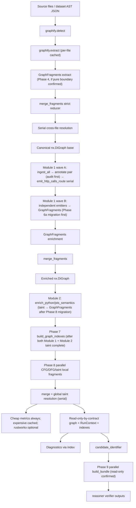

# depOS Pipeline Acceleration — Implementation Plan

## Implementation rule (staged rollout)

**Complete one phase at a time.** Each phase lands as **its own commit** (or PR) with:

- Full existing **pytest** suite green before merge.
- **Targeted tests** added for that phase's acceptance gate.
- **Do not start the next phase** until the current phase's gate passes (tests + any profiling/equivalence checks named in that phase).
- **Rollback:** the one-phase-per-commit rule makes `git revert <sha>` a safe rollback with no other work entangled. If a phase regression is not caught by equivalence tests, revert the phase commit, diagnose, and re-open as a fresh commit.

This keeps bisect and debugging tractable; avoid batching Phase 3–6 into one changeset.

## Implementation discipline

- One phase per commit; keep pytest green at each step.
- No public JSON schema changes to product artifacts.
- No reasoner, verifier, or prompt behavior changes in this acceleration pass (see **Out of scope**).
- Parallel mode must retain a **serial fallback** (`n_jobs=1` / `--no-parallel`) with equivalent results after gates.
- **Parallel defaults** (`n_jobs>1`, cache on by default, etc.) may only flip to "on" in release after **equivalence + profiling gates** pass on the repo fixture; until then, prefer conservative defaults and document in `docs/perf-acceleration.md`.

## Design principle

Workers never mutate the canonical `nx.DiGraph` **from parallel workers** (fragments return to the main process; only the reducer mutates). Each parallel stage produces immutable `GraphFragment` objects; a deterministic reducer running in the main process merges them. NetworkX remains the canonical representation; rustworkx is an optional analytics backend. The wire format of `findings.json`, `impact_paths.json`, `mcp_context.json`, `triage_backlog.json`, `product_summary.json`, etc. does **not** change.

**"Frozen" / read-only graph:** NetworkX graphs are mutable by default. Treat the graph as **read-only by contract** after agreed pipeline stages—**do not** call `nx.freeze(G)` in the first implementation pass; it can break downstream code that still mutates. If freezing is ever introduced, it must be **after** all mutation stages, with tests proving no consumer mutates, and must be optional/config-gated.

## Actual pipeline order (verified against codebase)

```
depos/snapshot.py:build_graph_for_root()
  └── graphify.detect → graphify.extract (per-file cached) → build_from_json → nx.DiGraph

depos/enrichment/semantic_edges.py:enrich_graph()  ← Module 1; ALL enrichers mutate graph in-place
  ├── ingest_all                    (adds nodes/edges)
  ├── annotate_fastapi_routes       (mutates node attrs)
  ├── annotate_ts_http_calls        (mutates node attrs)
  ├── emit_http_calls_route         (depends on both annotators above; adds edges)
  ├── emit_rls_edges
  ├── emit_migration_edges
  ├── emit_celery_payload_edges
  ├── emit_dependency_edges
  ├── emit_env_edges
  ├── emit_prompt_edges
  ├── emit_openapi_edges
  └── emit_nextjs_edges

depos/analysis/pipeline.py:run_modules_2_through_7()
  ├── Module 2: resolve_change_manifest → build_run_context()
  │     ├── compute_graph_metrics()              (read-only)
  │     ├── build_seam_edge_index()              (read-only)
  │     ├── enrich_python_semantics()            ← MUTATES: taint adds nodes/edges/graph.graph["taint_edges"]
  │     └── enrich_jsts_semantics()              ← MUTATES
  ├── Module 3: build_bundle()                   (read-only ✓)
  ├── Module 4: run_all_modes()                  (reasoner; no graph mutation)
  ├── Module 5: rank()                           (no graph mutation)
  ├── Module 6: verify_all()                     (no graph mutation)
  └── Module 7: evaluate_gray_zone()             (no graph mutation)
```

**Key fact:** `build_run_context` is Module 2 and runs **after** `enrich_graph`. Phase 7 indexes must be built after **both** complete.

## Target architecture



## Phase 1 — Profiling and dependencies ✅ DONE

**Implemented:**
- [pyproject.toml](pyproject.toml): `perf` extra added (`joblib`, `orjson`, `xxhash`, `diskcache`, `rustworkx`, `pyinstrument`, `scalene`).
- [depos/_perf.py](depos/_perf.py): `pyinstrument_session(output_path)` context manager; `Stage` timer.
- [depos/cli/__init__.py](depos/cli/__init__.py): `--profile PATH` added to `repo`, `diff`, and `dataset-pipeline` subcommands.

**Phase 1 completion:** `args.profile` is wired via `_profile_context` around `_run_pipeline` in `run_repo`, `run_diff`, and `run_dataset_pipeline` ([depos/cli/analyze.py](depos/cli/analyze.py)). Run IDs use `_new_run_id()` (`YYYYMMDD-HHMMSS-<6-hex>`).

**Runtime fallbacks (explicit):**
- **`joblib` missing:** disable parallel mode, force `n_jobs=1`, emit clear warning. If user sets `n_jobs>1`, **fail** with clear message.
- **`orjson` missing:** `_jsonio` falls back to stdlib `json` automatically.
- **`xxhash` missing:** cache uses `hashlib.blake2b` / SHA256; log once at init.
- **`diskcache` missing:** fail fast unless `--no-cache` was explicitly passed, in which case silently skip (no-op).
- **`rustworkx` missing:** fall back to NetworkX with warning; default remains NetworkX.

**Gate:** `_perf.py` imports without error; `--profile` flag accepted; no behavior change to existing pipeline output.

## Phase 2 — JSON I/O adapter ✅ DONE

**Implemented:**
- [depos/_jsonio.py](depos/_jsonio.py): `dumps(obj, *, sort_keys=True) -> bytes` and `loads(data) -> Any` — orjson when present, stdlib fallback.
- Adopted in [depos/snapshot.py](depos/snapshot.py): `persist_graph_json` uses `_jdumps`; `load_graph_json` uses `_jloads`.
- Adopted in [depos/analysis/ast_normalize.py](depos/analysis/ast_normalize.py): three `json.loads` call sites replaced.

**Intentionally NOT changed:**
- [depos/analysis/product_outputs.py](depos/analysis/product_outputs.py) `write_product_outputs()` — all five product output files remain on `json.dumps(payload, indent=2)`. This is the canonical byte-stable writer and must not change.

**Byte-stable artifacts** (single writer `json.dumps(payload, indent=2)` in `product_outputs.py`):
`findings.json`, `impact_paths.json`, `mcp_context.json`, `triage_backlog.json`, `product_summary.json`

Internal artifacts (`snapshot_*.json`, AST JSON reads, intermediate cache payloads) require structural equality only, not byte identity.

**Gate:** round-trip test on `snapshot.py` fixture with structural equality assertion; all five output files produce byte-identical output before and after.

## Phase 3 — GraphFragment abstraction + deterministic reducer ✅ DONE

**Implemented:**
- [depos/analysis/fragments.py](depos/analysis/fragments.py): `GraphFragment` (frozen dataclass, `metadata` must be `MappingProxyType`), `make_fragment` factory, `merge_fragments` reducer, `MergeReport`, `FragmentMergeError`, `ADDITIVE_ATTR_KEYS`, `GRAPH_METADATA_ALLOWLIST`.
- [tests/intelligence/test_graph_fragments.py](tests/intelligence/test_graph_fragments.py): construction, basic merge, determinism, scalar collisions, additive keys, metadata allowlist, attr updates.

**No enricher is migrated yet** — Phase 3 is infrastructure only. Enricher migration happens in Phase 6a.

**Pre-Phase-6a gate (required before 6a merges):** enumerate all attribute writes across every `emit_*` / enricher in the codebase; cross-check each key against `ADDITIVE_ATTR_KEYS`. Any key written more than once by different enrichers must either be added to the allowlist with justification or the emitters must be fixed. This is a required code-review step, not just test-passing.

**`HTTP_CALLS_ROUTE` edge key collision risk (pre-Phase-6a blocking fix):** `_edge_key` in [depos/enrichment/semantic_edges.py](depos/enrichment/semantic_edges.py) (lines 62–64) produces a key of the form `contract_kind:method:route_pattern`. Two different call sites resolving to the same route legitimately produce identical keys. Under Phase 3's strict collision detection, two fragments emitting edges with the same `(u, v)` pair but originating from different call-site nodes will trigger `FragmentMergeError` as a false positive. The edge key must incorporate the **source node ID** (the call-site node) before Phase 3 collision detection is finalized for `emit_http_calls_route`. This is a pre-Phase-6a blocking fix — do not migrate `emit_http_calls_route` until the key formula is updated.

**Key design facts:**
- `frozen=True` prevents field reassignment but not mutation of contained dicts. `metadata` is `MappingProxyType` at construction (enforced by `__post_init__`). Workers must not mutate fragment contents after construction.
- `merge_fragments` collects **all** hard collisions before raising `FragmentMergeError` so `MergeReport` is complete for debugging.
- `ADDITIVE_ATTR_KEYS`: `{"diagnostics", "tags", "evidence", "http_call_sites", "seam_edge_ids"}` — append+dedup for lists, union for sets, shallow merge for dicts.
- `GRAPH_METADATA_ALLOWLIST`: `{"taint_edges", "run_metadata", "coverage", "migration_glob", "seam_edge_index"}`.

**Gate:** all tests in `test_graph_fragments.py` pass; shuffled-input determinism confirmed; hard-collision test fails correctly with populated `MergeReport`.

## Phase 4 — Parallel file-level extraction (wrap graphify; prove boundary first)

**Do not assume symbol names.** Before writing the adapter, **read** [graphify/extract.py](graphify/extract.py) fully to understand the extraction entry point and whether it processes files independently or as a batch.

**Already known:** `graphify/cache.py` implements per-file SHA256 caching (`load_cached` / `save_cached`). `build_graph_for_root` in [depos/snapshot.py](depos/snapshot.py) calls `detect(root)` → `extract(paths)`.

**Safety sequence:**

1. Read full `graphify/extract.py`. Determine: does `extract(paths)` call LLM per file, or in a batch?
2. **If per-file boundary exists:** write `depos/ingest/parallel_extract.py` — `extract_parallel(root, *, n_jobs, cache) -> nx.DiGraph` using `joblib.Parallel(backend="loky")` with picklable `(path_str, root_str)` inputs only.
3. **If no pure boundary exists:** Phase 4 lands as an adapter commit with zero parallelism enabled. `n_jobs>1` accepted but falls back to serial with a warning. Document the finding in `docs/perf-acceleration.md`. **This is a valid Phase 4 result.**
4. Cross-file resolution stays serial in main process.

**Gate:** `n_jobs=1` structural equivalence to current `build_graph_for_root` output on a fixture.

## Phase 5 — xxhash + diskcache fragment cache

**Note:** `graphify/cache.py` already implements per-file SHA256 caching at `graphify-out/cache/{hash}.json`. The new `depos/cache.py` is a **separate, additive** post-enrichment layer — it does not replace the graphify cache.

**Graphify cache gap:** the existing cache key does not include parser/tree-sitter version or extractor config — a parser upgrade will produce stale hits until files change. Document this in `docs/perf-acceleration.md` and leave graphify/cache.py unchanged.

**Implemented:**
- [depos/cache.py](depos/cache.py): added `FragmentCache`, `OrjsonDisk`, stable cache-key builders, `EXTRACTOR_CONFIG_HASH_FIELDS`, xxhash/blake2b hashing, zero-error cache gate, and deterministic `taint_edges` sorting helper.
- [depos/analysis/config.py](depos/analysis/config.py): added `CacheConfig` with env overrides.
- [depos/cli/__init__.py](depos/cli/__init__.py) and [depos/cli/analyze.py](depos/cli/analyze.py): wired `--no-cache`, `--cache-dir`, and `--cache-clear` for `repo`, `diff`, and `dataset-pipeline`.
- [depos/enrichment/semantic_edges.py](depos/enrichment/semantic_edges.py): added declared `ENRICHER_SCHEMA_VERSION = "v1"` for future enrichment-fragment invalidation.
- [docs/perf-acceleration.md](docs/perf-acceleration.md): documented the graphify cache parser/config invalidation gap and depOS cache key dimensions.

**Gate result:** `uv run --no-sync pytest tests/test_depos_cache.py tests/intelligence/test_cli_smoke.py tests/intelligence/test_graph_fragments.py tests/ingest/test_parallel_extract.py tests/test_depos_snapshot.py -q` — 59 passed, 3 skipped.

- New [depos/cache.py](depos/cache.py): `FragmentCache` with `OrjsonDisk`, **`xxhash` when installed** else **`hashlib.blake2b` / SHA256**.
- **Per-file extraction cache key:**

  `stage | source_file | file_hash | language | depos_version | schema_version | parser_version | extractor_config_hash`

  where `extractor_config_hash` covers: ignore list, language allowlist, max file size, tree-sitter parser version, and any config flag that changes node/edge shape. The exact set must be **enumerated as a named constant** in `cache.py` — never derived dynamically.

- **Post-enrichment fragment cache key** (when caching Phase 6a enricher fragment results):

  `stage | source_file | file_hash | language | depos_version | schema_version | enricher_logic_version`

  where `enricher_logic_version` is a hash of all `emit_*` / enricher function source or a declared `ENRICHER_SCHEMA_VERSION` constant in `semantic_edges.py`. A change to any enricher body must invalidate cached fragments for unchanged source files — without this, a bug fix to an `emit_*` function produces stale cached results. The declared constant approach (`ENRICHER_SCHEMA_VERSION = "vN"`, bumped manually on any emit-function change) is preferred over runtime source hashing for stability.

- **Per-function CFG / DFG / taint cache key:**

  `function_id | source_file | function_source_hash | language | semantic_version | (version tuple)`

- Default cache root: `<DEPOS_DATA>/cache/`. Flags: `--no-cache`, `--cache-dir`, `--cache-clear`.
- **Do not cache** any run where enrichment errors occurred (checked via `MergeReport`).
- `taint_edges` list must be sorted by a deterministic key before caching and before merge.

**Gate:** cache on/off equivalence; stale-on-version-bump invalidation test; zero-error gate.

## Phase 6a — Enricher migration to fragments (no threading yet) ✅ DONE

**Implemented:**
- [depos/enrichment/http_probes.py](depos/enrichment/http_probes.py): `annotate_fastapi_routes` and `annotate_ts_http_calls` now return `GraphFragment` with `NodeAttrUpdate` entries instead of mutating graph directly.
- [depos/enrichment/semantic_edges.py](depos/enrichment/semantic_edges.py): `emit_http_calls_route` returns `GraphFragment`; deduplicates by `(caller, handler)` keeping highest-confidence match; `_edge_key` now incorporates `source_node_id`; `enrich_graph` orchestrates wave-by-wave `merge_fragments` calls.
- All Wave B emitters migrated to return `GraphFragment`:
  - [depos/enrichment/rls_resolver.py](depos/enrichment/rls_resolver.py): nodes + edges + `NodeAttrUpdate` for `rls_coverage_per_table`; `needs_manual_rls_config` still written directly to `graph.graph["run_metadata"]`.
  - [depos/enrichment/migrations.py](depos/enrichment/migrations.py): migration + table synth nodes + schema/precedes edges; deduplicates `(table_node, mig_node)` pairs.
  - [depos/enrichment/celery_payload.py](depos/enrichment/celery_payload.py): synthetic task `FragmentNode`s from `_find_task_defs`; one `PRODUCES_PAYLOAD` edge + one `TASK_CONSUMES` self-loop per caller/task pair (matches prior DiGraph overwrite semantics).
  - [depos/enrichment/deps_resolver.py](depos/enrichment/deps_resolver.py), [env_resolver.py](depos/enrichment/env_resolver.py), [prompt_resolver.py](depos/enrichment/prompt_resolver.py), [openapi_resolver.py](depos/enrichment/openapi_resolver.py), [nextjs_resolver.py](depos/enrichment/nextjs_resolver.py): all return `GraphFragment`.
- `ingest_all` (Layer 0 sub-ingestors) intentionally **not yet fragment-based** — they still mutate the graph directly and run first before any fragment waves. Migration is deferred to Phase 6a+.

**Gate result:** 92/93 enricher + integration tests pass; the 1 failure (`test_bugfix_preservation_properties`) is a pre-existing `PromptParts` API issue unrelated to enrichment.

**Post-6a state:** Wave A (`annotate_*`, `emit_http_calls_route`) and all Wave B `emit_*` paths produce `GraphFragment` values merged on the main thread ([depos/enrichment/semantic_edges.py](depos/enrichment/semantic_edges.py)). **`ingest_all` (Layer 0)** still mutates the graph directly before fragment waves; migrating it remains future work (Phase 6a+).

**Wave A ordering constraint (must be preserved):**
1. `ingest_all` serial
2. `annotate_fastapi_routes` and `annotate_ts_http_calls` (may run concurrently once migrated — audit mutations first)
3. `emit_http_calls_route` serial (depends on annotations from step 2)

**Metadata writes in `enrich_graph`** (lines 340–344):
- `graph.graph["migration_glob"]` — add to `GRAPH_METADATA_ALLOWLIST` or handle separately
- `graph.graph["run_metadata"]` — already in allowlist

**Gate:** all existing tests green; graph structure identical to pre-migration baseline (snapshot test).

## Phase 6b — Threading for enrichers (after 6a)

**Prerequisite:** Phase 6a complete and gate passed.

- Pass `ReadOnlyGraphView` to threading workers.
- Enable threading for independent Wave B enrichers (those with no cross-enricher read dependency).
- Serial path remains default (`--no-parallel` flag).

```python
class ReadOnlyGraphView:
    """Thin wrapper passed to threading workers to catch accidental mutations."""
    _FORBIDDEN = frozenset({
        "add_node", "add_edge", "remove_node", "remove_edge",
        "remove_nodes_from", "remove_edges_from", "update", "clear", "clear_edges",
    })
    def __init__(self, g): self._g = g
    def __getattr__(self, name):
        if name in self._FORBIDDEN:
            raise RuntimeError(f"mutation forbidden in parallel worker: {name}")
        return getattr(self._g, name)
    def __getitem__(self, key): return self._g[key]
    def __iter__(self): return iter(self._g)
    def __len__(self): return len(self._g)
```

**Gate:** threading equivalence test on fixture; serial and threaded `RunResult` identical.

## Phase 7 — Graph indexes (after Module 1 AND Module 2 taint complete)

**Build timing:** `build_run_context` is Module 2 ([pipeline.py:325](depos/analysis/pipeline.py)). It runs `enrich_python_semantics` and `enrich_jsts_semantics`, which currently mutate the graph (taint). Phase 7 indexes must be built **after both** complete. If Phase 8 migrates taint to fragments, indexes can be built after Module 1 enrichment + taint fragment merge.

- New [depos/analysis/graph_indexes.py](depos/analysis/graph_indexes.py):

  ```python
  @dataclass(frozen=True, slots=True)
  class GraphIndexes:
      node_by_id: dict[str, dict]
      nodes_by_type: dict[str, list[str]]
      nodes_by_file: dict[str, list[str]]
      functions_by_file: dict[str, list[str]]
      symbols_by_name: dict[str, list[str]]
      routes_by_path: dict[tuple[str, str], list[str]]
      env_vars_by_name: dict[str, list[str]]
      packages_by_name: dict[str, list[str]]
      diagnostics_by_node: dict[str, list[dict]]
      callers_by_callee: dict[str, list[str]]
      callees_by_caller: dict[str, list[str]]
      seams_by_node: dict[str, list[str]]
      taint_edges_by_source: dict[str, list[int]]
      taint_edges_by_sink: dict[str, list[int]]
  ```

  **Immutability caveat:** `frozen=True` prevents field reassignment but the dict values are mutable. Treat all fields as read-only after construction.

- Add `indexes: Optional[GraphIndexes] = None` to [depos/analysis/run_context.py](depos/analysis/run_context.py) `RunContext`.
- **Staleness contract:** once indexes are built, no pipeline stage may mutate the graph. Phase 8 workers produce fragments only (enforced by `ReadOnlyGraphView`). Pre-Phase-8 audit: no `graph.add_node` / `graph.add_edge` after index build.
- **Memory note:** `GraphIndexes` holds multiple redundant lookup tables. Profile on the repo fixture before enabling by default; document overhead in `docs/perf-acceleration.md`.
- Refactor [depos/diagnostics.py](depos/diagnostics.py) `map_diagnostics_to_nodes` to use `indexes.nodes_by_file`.

**Gate:** index correctness — `nodes_by_file` matches direct graph traversal; `callers_by_callee` matches edge query.

## Phase 8 — Parallel CFG / DFG / taint ✅ IMPLEMENTED

**Taint:** [depos/analysis/taint.py](depos/analysis/taint.py) uses `TaintScopeWork` + `compute_*_taint_work` / `apply_taint_scope_work` (workers read-only on the graph; main thread is the sole writer to topology and `graph.graph["taint_edges"]`). [depos/analysis/semantic_python.py](depos/analysis/semantic_python.py) and [depos/analysis/semantic_jsts.py](depos/analysis/semantic_jsts.py) optionally parallelize taint via `ThreadPoolExecutor` when `PerfConfig.taint_n_jobs > 1`.

**CFG/DFG:** [depos/analysis/semantic_cfg_dfg.py](depos/analysis/semantic_cfg_dfg.py) builds per-scope work on a local `nx.DiGraph`, converts to `GraphFragment` (`make_fragment(..., file_hash=scope_id)` for deterministic merge order), and `apply_cfg_dfg_scope_work` calls `merge_fragments` on the main graph. Compute can run in a thread pool when `PerfConfig.cfg_dfg_n_jobs > 1` (`DEPOS_PERF_CFG_DFG_N_JOBS`, CLI `--cfg-dfg-n-jobs`); merges apply in scope-list order.

**Gate:** `taint_edges` sorted in `build_run_context`; serial vs parallel taint equivalence; serial vs parallel CFG/DFG equivalence for Python in `tests/intelligence/test_graph_indexes_and_perf.py`.

## Phase 9 — Parallel bundles, metrics, config

### 9a. Bundle purity gate (mandatory — already confirmed)

Grep audit of [depos/analysis/context_bundle.py](depos/analysis/context_bundle.py) found **no** `add_node`, `add_edge`, or `graph.graph[...]` writes. `build_bundle` is read-only. Threading is safe.

**Parallelism:**
- **Start with `backend="threading"`** to avoid pickling the graph.
- If profiling shows **CPU-bound** BFS/neighborhood expansion, switch to **`loky`** with compact per-candidate inputs only.

### 9b. Metrics + rustworkx

- Split [depos/analysis/graph_metrics.py](depos/analysis/graph_metrics.py): `compute_cheap_metrics` always; `compute_expensive_metrics` behind cache + fingerprint; optional `rustworkx` backend for expensive algorithms only.
- CLI: `--metrics-backend {networkx,rustworkx}`, `--no-expensive-metrics`.

### 9c. Config

- Extend [depos/analysis/config.py](depos/analysis/config.py) with `PerfConfig` and env `DEPOS_PERF_*` + CLI overrides.

**Gate:** bundle threading `RunResult` equivalence test.

## Phase 10 — Determinism, tests, and reporting

- Equivalence: `n_jobs`, cache on/off, structural equality of graphs and canonicalized outputs.
- Reducer: fixtures and golden merge paths must complete with **zero hard collisions**; any **scalar identity** conflict is a test failure.
- `docs/perf-acceleration.md`: parallelized stages, serial stages and why, cache keys, invalidation, profiling command, before/after timings.
- **Output byte-identity:** checked-in fixtures under [tests/fixtures/product_outputs_golden/](tests/fixtures/product_outputs_golden/) for all five product JSONs; [tests/analysis/test_product_outputs_golden.py](tests/analysis/test_product_outputs_golden.py) compares bytes from `write_product_outputs(..., generated_at=...)` to those files. Structural coverage remains in [tests/analysis/test_product_outputs.py](tests/analysis/test_product_outputs.py). Regeneration notes: [docs/perf-acceleration.md](docs/perf-acceleration.md).
- `graph.graph["taint_edges"]` list content (order + values) must be identical between serial and parallel runs.

## Performance budget (soft targets)

Document measured times on the **repo fixture** in `docs/perf-acceleration.md`. Treat as **guidance**, not CI gates unless later promoted.

- **Warm cache:** repeated run should aim for **≥2× faster** on the combined **extraction + enrichment** stages vs baseline (cold serial, no depOS cache), on the same machine/fixture.
- **Parallel cold run:** wall time should **not** exceed serial cold by **>10%** (regression tolerance). If parallel cold is slower beyond that, **keep serial as default** for that stage and document why.
- If targets are missed, parallelism remains **opt-in** or **off by default** until improved.

## Out of scope

- No Ray / Dask / Celery / Spark.
- No CPG or ASG — [depos/graph_source.py](depos/graph_source.py) `CPGSource` stays `NotImplementedError`.
- No replacement of NetworkX as the canonical graph.
- No public schema changes to product JSON artifacts.
- **Reasoner / LLM stack:** no changes inside [depos/analysis/reasoning_engine.py](depos/analysis/reasoning_engine.py).
- **Verifier:** no logic changes to [depos/analysis/verifier.py](depos/analysis/verifier.py).

## Risks and mitigations

| Risk | Mitigation |
|---|---|
| graphify has no pure per-file extraction boundary | Serial adapter path remains default; Phase 4 explicitly documents no-op as valid; document in `docs/perf-acceleration.md` |
| Enrichers currently mutate graph; threading is unsafe | Phase 6a migrates all enrichers to fragments before Phase 6b enables threading |
| Taint analysis mutates graph (confirmed lines 177, 244, 246, 260, 341, 343, 357) | Phase 8 migration required; taint must return `TaintFragment`; main thread is sole writer to `graph.graph["taint_edges"]` |
| `loky` + full graph passed to workers | Fragment design prevents this; workers receive only picklable per-file/per-function inputs |
| GIL limits threading throughput | Profile with Phase 1 tooling; switch CPU-bound stages to `loky` with minimal payloads |
| Strict reducer breaks existing double-writes | Pre-Phase-6a emitter audit required; tighten `ADDITIVE_ATTR_KEYS`; fix emitters before merge |
| GraphIndexes staleness after Phase 8 mutations | Phase 8 pre-merge audit: no direct graph mutations after index build; `ReadOnlyGraphView` catches accidents in tests |
| Memory pressure from GraphIndexes | Profile before enabling by default; document overhead in `docs/perf-acceleration.md` |
| Cache stale on parser version change | graphify cache key does not include parser version; document gap; Phase 5 `depos/cache.py` key includes `parser_version` |
| Non-deterministic `taint_edges` list order | Sort by deterministic key before caching and before golden comparison |
| `HTTP_CALLS_ROUTE` false-positive collision under strict reducer | `_edge_key` in `semantic_edges.py:62–64` uses `contract_kind:method:route_pattern`; two call sites to the same route share a key, triggering `FragmentMergeError` as a false positive; source node ID must be incorporated into the key before Phase 6a migrates `emit_http_calls_route` |
| Enricher logic change does not invalidate post-enrichment cache | Post-enrichment fragment cache key must include `enricher_logic_version` (a declared `ENRICHER_SCHEMA_VERSION` constant in `semantic_edges.py`, bumped on any emit-function change); without it, a bug fix to an enricher body leaves stale cached fragments for unchanged source files |
