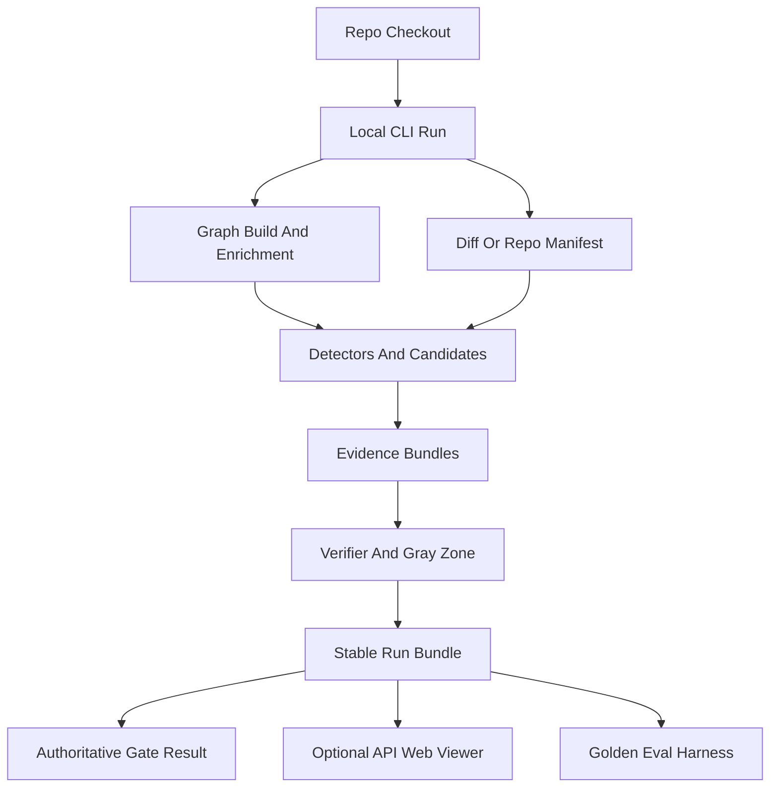

# depOS Production V1 Plan

## Summary
Make depOS v1 a local developer product centered on one reliable CLI workflow: analyze a repo or diff, produce a stable run bundle, explain whether the result is trustworthy, and optionally view/import that bundle through the local API/web dashboard. The web/Supabase path remains supported, but it becomes a secondary operator surface over durable CLI artifacts rather than the primary analysis engine.

## Assumptions
- V1 should keep `depos-intel` working, but add a clearer umbrella/product entrypoint rather than forcing users to discover separate `analyze`, `gate`, and `intent-context` flows.
- V1 should default to local/offline deterministic analysis. LLM/reasoner providers should be opt-in or explicit per profile, and every output should state whether source text left the machine.
- One authoritative `gate_result.json` should reconcile legacy `violations.json`, product CI decisions, reasoner/run health, and GIC strict results.
- Optional API/web support should import or display local run bundles without changing the CLI gate decision.

## Requirements
- R1. A fresh user can run one documented local flow against a checkout and get a complete, deterministic output directory.
- R2. Every run explains its health: graph source, diff source, evidence quality, reasoner mode, detector policy, skipped work, warnings, and gate decision.
- R3. Diff analysis must be hunk/source-aware enough that users can trust “changed impact” as different from broad repository scanning.
- R4. Confirmed findings must mean deterministic verifier support; approximate, low-evidence, uncited, or weak graph coverage cases must remain review-only or gray-zone.
- R5. Outputs must be stable machine contracts: schema versions, relative paths, checksums, redaction status, SARIF fingerprints, and replayable evidence bundles.
- R6. Testing must quantify usefulness: detector precision/recall on labeled fixtures, pipeline recall at top-k, runtime budgets, determinism, and artifact completeness.
- R7. The API/web dashboard must support the CLI-first workflow by displaying imported run bundles, not by inventing a separate analysis path.

## Scope Boundaries
- Keep `graphify/` as the extraction engine; do not start a full CPG rewrite for v1.
- Do not make hosted multi-tenant production the v1 success criterion. Supabase/web remains supported for local/operator viewing and future hosted use.
- Do not market approximate Group B/C detectors as formal proof. Use honest statuses and caveats.
- Do not make LLM success required for a healthy local run unless the selected profile explicitly requires it.

## High-Level Flow
> This illustrates the intended approach and is directional guidance for review, not implementation specification.

## Key Technical Decisions
- Introduce a product-level CLI workflow while preserving existing subcommands: use `depos-intel analyze repo/diff` internally, but expose a clearer v1 command path and help output.
- Make artifact generation a first-class boundary: one manifest, one gate result, stable JSON/SARIF, and product outputs written for every supported run mode.
- Fail loudly on pipeline wiring failures: enrichment degradation can be allowed with caveats, but missing core analysis modules must not return an empty “clean” result.
- Treat reasoner/LLM as a profile-controlled enhancement: deterministic local detectors and verifier remain the trust boundary.
- Make evaluation part of the product: fixture labels, metrics reports, and budgets are required artifacts/tests, not ad hoc notebooks.

## Implementation Units
- U1. **Freeze The V1 CLI Contract**

  **Goal:** Provide one discoverable local-first workflow and consistent command behavior.

  **Files:**
  - Modify: `pyproject.toml`
  - Modify: `depos/cli/__init__.py`
  - Modify: `depos/cli/analyze.py`
  - Modify: `.env.example`
  - Test: `tests/intelligence/test_cli_smoke.py`
  - Test: `tests/intelligence/test_cli_v1_contract.py`

  **Approach:** Add a product-facing command/alias and profiles such as quick, full, and llm-assisted while keeping existing subcommands compatible. Ensure machine output stays on stdout, progress/warnings on stderr, and config precedence is documented as flags > env > project config > defaults.

  **Test scenarios:**
  - Happy path: v1 CLI help shows local repo, diff, gate, artifact, and optional serve/viewer flows.
  - Happy path: existing `depos-intel analyze repo`, `diff`, `gate`, and `intent-context` still parse and dispatch.
  - Error path: missing repo path, invalid graph JSON, or invalid profile exits with a config/input error and no misleading run success.
  - Integration: CLI emits a stable JSON summary with `run_id`, `output_dir`, health, and gate path.

- U2. **Create A Stable Run Bundle Contract**

  **Goal:** Make every run produce a complete operator bundle with schema versions, checksums, provenance, and redaction metadata.

  **Files:**
  - Modify: `depos/cli/analyze.py`
  - Modify: `depos/analysis/schemas.py`
  - Modify: `depos/analysis/product_outputs.py`
  - Modify: `depos/output/json.py`
  - Modify: `depos/output/sarif.py`
  - Create: `depos/output/run_manifest.py`
  - Test: `tests/intelligence/test_run_bundle_contract.py`
  - Test: `tests/output/test_golden_roundtrip.py`
  - Test: `tests/analysis/test_product_outputs_golden.py`

  **Approach:** Add `run_manifest.json` and normalize artifact writing across repo, diff, dataset, and replay modes. Include CLI version, repo SHA, dirty/untracked state, command args, graph source, detector policy, reasoner mode, redaction status, artifact checksums, and schema versions.

  **Test scenarios:**
  - Happy path: full-repo and diff runs write the same required artifact family.
  - Edge case: fixed timestamps/seeds produce byte-stable normalized artifacts except explicitly volatile fields.
  - Error path: malformed or missing artifact files are reported as bundle validation failures.
  - Integration: product outputs and legacy `violations.json` both appear in the manifest.

- U3. **Unify Gate Semantics**

  **Goal:** Produce one authoritative gate decision for CLI, CI, product outputs, and optional GIC results.

  **Files:**
  - Modify: `depos/output/gate.py`
  - Modify: `depos/cli/__init__.py`
  - Modify: `depos/cli/analyze.py`
  - Modify: `depos/analysis/product_outputs.py`
  - Modify: `depos/intent_graph/` gate-related modules
  - Test: `tests/output/test_ci_gate.py`
  - Test: `tests/output/test_gate_result_contract.py`
  - Test: `tests/dataset_pipeline/test_strict_exit_codes.py`

  **Approach:** Add `gate_result.json` with a single precedence table: invalid input/config, runtime failure, degraded/budget failure, policy block, review-needed, pass. Keep `violations.json` compatibility, but make the v1 CLI and docs point to `gate_result.json` as the source of truth.

  **Test scenarios:**
  - Happy path: no confirmed blockers and healthy run exits pass.
  - Happy path: confirmed high/critical findings fail unless allowlisted.
  - Edge case: gray-zone/review-only findings request review without pretending to be confirmed failures.
  - Error path: expired allowlist entries do not suppress findings.
  - Integration: GIC P0 unresolved, product CI decision, and legacy violations conflict cases resolve deterministically.

- U4. **Make Diff And Graph Reliability Trustworthy**

  **Goal:** Replace file-name-only diff behavior with hunk-aware change manifests and visible graph reliability scoring.

  **Files:**
  - Modify: `depos/analysis/candidate_identifier.py`
  - Modify: `depos/analysis/run_context.py`
  - Modify: `depos/analysis/seams.py`
  - Modify: `depos/enrichment/semantic_edges.py`
  - Modify: `depos/graph_source.py`
  - Test: `tests/analysis/test_change_manifest.py`
  - Test: `tests/intelligence/test_diff_pipeline_e2e.py`
  - Test: `tests/ingest/test_path_resolution.py`

  **Approach:** Support explicit diff files, git base/head, dirty worktree, and untracked-file handling. Attach line ranges/hunks to manifest entries where possible, map them to graph nodes, detect stale snapshots, and expose graph/stitcher reliability as caveats and product confidence.

  **Test scenarios:**
  - Happy path: changed hunks map to expected nodes and produce diff-anchored candidates.
  - Edge case: dirty worktree and untracked files are included or explicitly reported based on selected mode.
  - Error path: stale graph snapshot versus repo SHA is surfaced before analysis trust is claimed.
  - Integration: low stitcher coverage lowers impact confidence/request-review without mutating verifier outcomes.

- U5. **Harden Pipeline Failure Modes And Evidence Accounting**

  **Goal:** Remove silent “clean” outcomes caused by import failures, degraded modules, weak evidence, or accounting bugs.

  **Files:**
  - Modify: `depos/cli/analyze.py`
  - Modify: `depos/analysis/pipeline.py`
  - Modify: `depos/analysis/context_bundle.py`
  - Modify: `depos/analysis/observability.py`
  - Modify: `docs/runbooks/reasoner-zero-findings.md`
  - Test: `tests/intelligence/test_pipeline_failure_modes.py`
  - Test: `tests/intelligence/test_bundle_evidence_accounting.py`
  - Test: `tests/dataset_pipeline/test_zero_findings_regression.py`

  **Approach:** Convert missing core pipeline imports into runtime/tool failures, keep enrichment failures as explicit degraded states, and ensure evidence counts match bundles in both serial and parallel paths. Require empty findings to be accompanied by healthy evidence/path/reasoner state.

  **Test scenarios:**
  - Error path: core analysis import failure exits non-zero and writes a failed run summary where possible.
  - Edge case: enrichment unavailable marks degraded coverage instead of silently disappearing.
  - Happy path: evidence quality counts equal built bundle counts for serial and parallel bundle builds.
  - Integration: zero findings with failed reasoner, weak evidence, or poor path resolution is not reported as clean.

- U6. **Make Detector Results Honest And Calibrated**

  **Goal:** Improve detector trust by typing payloads, labeling approximate detectors clearly, and measuring evidence quality before user-facing confirmation.

  **Files:**
  - Modify: `depos/analysis/schemas.py`
  - Modify: `depos/analysis/detectors/__init__.py`
  - Modify: `depos/analysis/detectors/policy.py`
  - Modify: `depos/analysis/detectors/builtin/`
  - Modify: `depos/analysis/verifier.py`
  - Modify: `depos/analysis/verifier_rules.py`
  - Test: `tests/detectors/test_detector_contracts.py`
  - Test: `tests/detectors/test_detector_eval_golden.py`
  - Test: `tests/intelligence/test_verifier_rules.py`

  **Approach:** Continue using the registry pattern, but tighten detector payload contracts and product labeling. Calibrate severity/confidence/status so approximate detectors cannot become misleading confirmed findings without deterministic verifier evidence.

  **Test scenarios:**
  - Happy path: every registered detector exposes version, semantic requirements, output contract, and evidence type.
  - Edge case: detectors requiring CFG/DFG/taint do not run without those layers and record skip reasons.
  - Error path: detector exceptions appear in stats and run health without crashing unrelated detectors.
  - Evaluation: labeled fixtures report TP/FP/FN and detector-level precision/recall.

- U7. **Build The Evaluation And Benchmark Harness**

  **Goal:** Give you a repeatable way to quantify whether depOS is useful, not just whether it runs.

  **Files:**
  - Create: `depos/eval/`
  - Create: `tests/fixtures/eval/`
  - Create: `tests/eval/test_detector_eval_golden.py`
  - Create: `tests/eval/test_pipeline_recall_at_k.py`
  - Create: `tests/perf/test_pipeline_runtime_budget.py`
  - Modify: `docs/dataset-pipeline.md`
  - Modify: `docs/perf-acceleration.md`

  **Approach:** Add small labeled repos and node-link fixtures with known bug/no-bug cases, negative/fixed variants, expected detector IDs, expected candidate ranks, and optional slow benchmarks. Emit `eval_report.json` with precision, recall, F1, recall@k, severity correctness, runtime, determinism hashes, and artifact completeness.

  **Test scenarios:**
  - Happy path: seeded vulnerable fixture produces expected detector candidates and at least one verified/reviewable product finding.
  - Happy path: fixed/negative fixture does not produce confirmed blockers.
  - Edge case: unsupported language or low evidence fixture records unknown/review-needed instead of false confidence.
  - Performance: fixture runtime stays within budget or reports a visible degraded/budget state.

- U8. **Upgrade SARIF, Redaction, And AI Context Exports**

  **Goal:** Make outputs useful in industry-standard CI and safe for local/AI workflows.

  **Files:**
  - Modify: `depos/output/sarif.py`
  - Modify: `depos/output/json.py`
  - Modify: `depos/output/pr_comment.py`
  - Modify: `depos/analysis/product_outputs.py`
  - Modify: `depos/analysis/citations.py`
  - Test: `tests/output/test_sarif_contract.py`
  - Test: `tests/output/test_redaction.py`
  - Test: `tests/analysis/test_product_outputs.py`

  **Approach:** Emit SARIF 2.1.0 with stable rule IDs, locations, fingerprints, run category, and detector metadata. Ensure secrets are redacted from snippets, MCP context, PR comments, SARIF, web/API payloads, and logs.

  **Test scenarios:**
  - Happy path: SARIF validates required fields and stable fingerprints for repeated runs.
  - Edge case: multiple detectors/languages do not collide on SARIF categories.
  - Error path: secret-like values are redacted consistently across every output format.
  - Integration: MCP context preserves evidence and caveats without leaking raw secrets.

- U9. **Add Local API/Web Run Bundle Import And Viewer**

  **Goal:** Make the optional dashboard useful for CLI-first users by viewing run bundles and gate results.

  **Files:**
  - Modify: `depos/api_server.py`
  - Modify: `depos/intelligence_store.py`
  - Modify: `depos/db.py`
  - Modify: `supabase/migrations/`
  - Modify: `apps/web/lib/depos/server.ts`
  - Modify: `apps/web/lib/supabase/queries.ts`
  - Modify: `apps/web/app/orgs/[slug]/intelligence/`
  - Modify: `apps/web/components/intelligence/`
  - Test: `tests/integration/test_graph_snapshot_api_flow.py`
  - Test: `tests/test_depos_api.py`
  - Test: `apps/web` tests if the existing web test harness supports them

  **Approach:** Add an API pathway to import validated local run bundles into the existing intelligence run model, preserving manifest/gate/product artifacts and redaction metadata. Update the dashboard to show run health, gate result, findings, detector stats, artifacts, caveats, and evidence links.

  **Test scenarios:**
  - Happy path: authenticated admin imports a valid bundle and sees persisted run/finding counts.
  - Error path: malformed bundle, checksum mismatch, or wrong org/repo is rejected.
  - Authorization: non-members and non-admins cannot import or view restricted runs.
  - Integration: dashboard displays gate result and run health without recomputing analysis.

- U10. **Write Operator Docs And Manual Test Runbooks**

  **Goal:** Make the product manually usable by you and understandable by future users.

  **Files:**
  - Modify: `README.md`
  - Modify: `docs/README.md`
  - Create: `docs/runbooks/local-cli-v1.md`
  - Create: `docs/runbooks/local-viewer.md`
  - Create: `docs/runbooks/evaluation-harness.md`
  - Modify: `docs/depos-pipeline-current-state.md`
  - Modify: `.env.example`

  **Approach:** Document the v1 local flow, artifact bundle, gate decision table, reasoner profiles, privacy posture, evaluation metrics, and optional API/web viewer. Align docs with the current-state pipeline and remove misleading target-state claims from user-facing docs.

  **Test scenarios:**
  - Documentation smoke: README and runbook references resolve to real CLI commands/files.
  - Manual acceptance: a user can follow the runbook from install through analysis, gate, artifact inspection, optional viewer import, and eval report.
  - Regression: current-state docs reference real module paths and do not describe unimplemented CPG/source behavior as shipped.

## Phased Delivery
- Phase 1: U1, U2, U3, U5. This produces a trustworthy local command, bundle, gate, and failure model.
- Phase 2: U4, U6, U8. This improves analysis quality, honesty, and CI/export readiness.
- Phase 3: U7. This makes usefulness quantifiable with labeled fixtures and metrics.
- Phase 4: U9, U10. This turns the CLI bundle into an optional local dashboard workflow and complete operator documentation.

## Success Metrics
- A local run writes a complete bundle with no missing required artifacts across repo, diff, and dataset modes.
- Repeated fixed-input runs produce stable normalized artifact hashes.
- `gate_result.json` and process exit code agree in every tested case.
- Diff fixtures prove hunk-to-node anchoring and stale graph detection.
- Evaluation reports include per-detector precision/recall/F1 and recall@k for seeded fixtures.
- Zero-finding runs are classified as healthy-clean, review-needed, degraded, or failed with no ambiguity.
- SARIF output passes schema-level and GitHub/code-scanning compatibility checks.
- The dashboard can import/display a local bundle without altering the CLI decision.

## Risks And Mitigations
- The plan is large enough to sprawl. Mitigation: land Phase 1 first and require every later phase to preserve the run-bundle and gate contracts.
- Detector precision may be lower than desired once measured. Mitigation: ship honest statuses and use eval metrics to choose which detectors are blocking versus review-only.
- LLM-assisted analysis may remain variable. Mitigation: deterministic local mode is default, LLM is explicit, and reasoner health is visible.
- Web/Supabase could distract from CLI value. Mitigation: viewer work starts only after bundle/gate contracts are stable.

## Sources And References
- `README.md`
- `pyproject.toml`
- `docs/product.md`
- `docs/architecture.md`
- `docs/depos-pipeline-current-state.md`
- `docs/dataset-pipeline.md`
- `docs/runbooks/reasoner-zero-findings.md`
- `depos/cli/__init__.py`
- `depos/cli/analyze.py`
- `depos/analysis/product_outputs.py`
- `depos/output/gate.py`
- `depos/api_server.py`
- `tests/intelligence/test_cli_smoke.py`
- `tests/output/test_ci_gate.py`

## Implementation audit (2026-05-05)

Cross-check against the repo: **Phase 1–3 and most of Phase 4 are implemented.** Corrections to the unit list above:

- Unified gate artifact: **`depos/output/gate_result.py`** (not only `gate.py`); `tests/output/test_gate_result_contract.py`.
- Strict exit codes: **`tests/dataset_pipeline/test_strict_exit_codes.py`** pins `_strict_exit_code`; integration coverage remains in `tests/dataset_pipeline/test_zero_findings_regression.py`.
- Diff hunk behavior: **`tests/analysis/test_change_manifest.py`**; there is no file named `test_diff_pipeline_e2e.py` — overlap lives in `tests/intelligence/test_canonical_pipeline_consolidation.py` and `tests/intelligence/test_pipeline_failure_modes.py`.
- API bundle import: **`depos/intelligence_bundle_import.py`**, route **`import-local-bundle`**; web helpers **`importLocalIntelligenceBundle`** in `apps/web/lib/depos/server.ts`. Full dashboard “import UI” is still operator/API-first (runbook); DB rows do not yet store `gate_result` JSON — the API returns it on import when files exist on disk.
- **`STRICT_EXIT_INGEST_ERROR` (4)** is wired: non-empty `run_metadata.ingest_errors` under `depos-intel analyze dataset-pipeline --strict` exits `4` (precedence before reasoner/path checks). The strict exit table in `docs/runbooks/reasoner-zero-findings.md` matches `_strict_exit_code` (`2` = reasoner failed or degraded, not split across `2`/`4`).