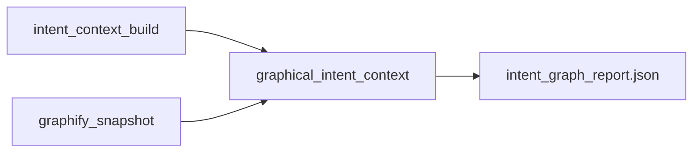

# Graphical Intent Context (GIC) — design and implementation plan

## Plain language (what this is for)

**In one sentence:** GIC answers “Do our **written goals** (docs, ADRs, OFT links) line up with what the **code tree** actually contains?” — not “Is the app perfect?”

- **It is good for:** wrong paths, missing files, “we said we’d build X” but nothing in the graph points at it, trace tags that don’t land on real code, “this part of the app has no doc coverage.”
- **It is not good for:** “Does the button feel right?” or “Is the business logic 100% correct?” — that still needs **tests and humans**.

**Default behavior (locked in):** the command **always** produces a report. It **does not fail your build by default**, so a messy first pass does not break your day. When you are ready, you use **`--strict`** (or a config file in a later iteration) to **fail CI** if important (P0) items still have no match in the graph.

---

## Problem statement (industry framing)

**Prevalent pain:** Teams (especially with LLM-assisted “vibe” coding) ship code that *sounds* aligned with docs and goals but **drifts**: wrong wiring, missing guards, partial features, or “paper architecture” that the tree does not implement.

**What a credible product must claim:** GIC is **requirements↔implementation traceability under structural and repository truth**, not a magic “understands product intent” oracle. It should sit next to (not replace) **tests, typecheck, security scans, and human review**. That positioning matches how serious tools are adopted: **auditable artifacts**, **reproducible scores**, **explicit failure modes**.

**What already exists in this repo (do not reinvent):**

- **Intent IR** — [`depos/intent_context/build.py`](depos/intent_context/build.py) emits versioned artifacts; contract in [`docs/intent-context.md`](docs/intent-context.md). Key files: `intent_manifest.json`, `intent_chunks.jsonl`, `intent_units.json`, `intent_trace_hints.json` (OFT-style **nodes/edges/coverage_tags** hints), tier fields (`P0`/`P1`/`P2`, `effective_weight`).
- **Graph truth** — [`depos/snapshot.py`](depos/snapshot.py) (`graphify` extract → `build_from_json`) plus depOS **enrichment** under [`depos/enrichment/`](depos/enrichment/) (e.g. HTTP↔route edges, seam relations). This is the **structural** side of “what the codebase actually contains.”

**Gap to close:** A **join + scoring** layer that maps **IntentUnit** claims (and optional OFT links) to **graph nodes/edges** (and **unresolved** cases), producing a **report** suitable for CI/PR and local runs.

---

## Design principles (avoid “garbage that does namesake work”)

1. **Every score is backed by evidence pointers** — file paths, node ids, edge keys, or “unresolved reason.” No standalone black-box percent without drill-down.
2. **Tier-aware severity** — reuse `effective_tier` / `effective_weight` from intent units ([`depos/intent_context/schemas.py`](depos/intent_context/schemas.py)); P0 conflicts weigh more than P2 noise (already documented in [`docs/intent-context.md`](docs/intent-context.md)).
3. **Three classes of checks** (label them explicitly in the report so users trust the system):
   - **Deterministic / structural** — resolvable from graph + path hints (default, always on).
   - **Tag / trace** — OFT and coverage tags joined to graph by path+line from existing hint structures (`intent_trace_hints.json`, `intent_coverage_tags.jsonl`).
   - **Optional semantic assist (OpenAI)** — *only* for **disambiguation** or **rubric-scored** “claim plausibility vs neighborhood summary,” never as the sole source of “PASS.” Mocked in CI; real key for local/optional job.
4. **Explicit non-goals in docs** — GIC does not prove full functional correctness, UX quality, or business success; it reduces **doc↔code misalignment risk** and accelerates **review**.

---

## Core data model (new module)

Add a small package, e.g. [`depos/intent_graph/`](depos/intent_graph/) (name TBD), containing:

- **Inputs:** paths to `intent_out/` (manifest + units + optional chunks), and `G` (NetworkX) or `graph.json` node-link.
- **Join graph** (internal, not the code graph):
  - **IntentUnit** → **candidate graph locations** from `scope_hints`, `evidence[]`, OFT `oft_covers` / `oft_needs`, and `intent_trace_hints` node ids / coverage tag locations.
  - **Resolver rules** (deterministic, ordered):
    1. Exact path match to node `source_file` (normalize with `Path.as_posix()`).
    2. Glob / prefix rules from `.depos/intent.yaml` if you already path-classify (reuse intent policy).
    3. OFT / tag line ranges → nearest AST node from extraction (if available in graph node attrs: line ranges—**verify** against graphify node schema; if missing, downgrade to file-level only and record limitation).
- **Output record per unit:** `status` ∈ {`supported`, `partial`, `unresolved`, `conflict`}, `confidence` (structural), `evidence: [{kind, ref}]`, and `effective_tier` (copy from unit).

**Exact definitions (must be in schema + docs):**

| Status | Meaning |
|--------|--------|
| `supported` | At least one **file** in the graph matches a scope_hint or evidence path **and** (when tag line is present) a **node** in that file with `source_location` line **contains** the tag line (or nearest function node by line order). |
| `partial` | **File** exists in the graph (some node has same `source_file` after path normalize) but line-level or symbol-level match not available (e.g. no `source_location` on nodes, or hint is file-only). |
| `unresolved` | No matching file, or path outside repo, or empty hints **and** no OFT/coverage join. Must set **`unresolved_reason`** from a **fixed enum** (e.g. `no_matching_file`, `no_graph_nodes_for_file`, `empty_scope_hints`, `path_outside_repo`, `sha_mismatch_degraded` — `sha_mismatch` is warning-only on report, not auto-fail in default mode). |
| `conflict` | **Only** if two **deterministic** facts disagree (reserved for v1+; may be empty in first release). If no dual signal, emit `unresolved` with `insufficient_graph_signal` instead of fake conflicts. |

**Path + line resolution (concrete):** graphify nodes use `source_file` and `source_location: "L{line}"` (see [`graphify/extract.py`](graphify/extract.py) `add_node`). Parse `L(\d+)`; for a coverage tag at line `T`, pick the node in the same file with **largest** `line <= T` (innermost “container” intuition) or document tie-break. If no line, **file-level** only → `partial`.

**Commit alignment:** if `intent_manifest.repo_sha` ≠ `git rev-parse HEAD` at `repo_root`, set report field `commit_alignment: "mismatch"` and add a **warning** block; default mode does not fail. `--strict` may optionally fail on mismatch (document as opt-in sub-flag e.g. `--require-same-commit`).

**Conflicts (only when you have dual signals):** e.g. intent says “all routes authenticated” but graph/detector signal shows a public route without auth edge — that requires **either** existing seam/auth edges in `G` **or** a small set of **GIC micro-detectors** (optional phase 2) that are literally just queries on `G` (not LLM). Start **without** inventing new detectors: report **“insufficient graph signal”** instead of a fake conflict.

---

## Metrics (product + science)

Report at **three layers** so you can test “intent you already have” vs “new graph context”:

### A. Intent layer quality (baselines — mostly from existing IR)

| Metric | Definition | Source |
|--------|------------|--------|
| `intent_units_total` | Count of units by extractor | `intent_units.json` |
| `intent_tier_mix` | Counts P0/P1/P2 | manifest / units |
| `intent_unresolved_rate` | Units with empty `scope_hints` and no OFT link | units |
| `trace_hint_coverage` | % of P0 units with at least one path-level hint | units + trace_hints |

These establish whether **your intent extraction** is usable *before* graph join.

### B. Graph context layer (new)

| Metric | Definition |
|--------|------------|
| `gic_resolved_rate` | Fraction of P0 (and separately P1) units with status `supported` or `partial` |
| `gic_unresolved_rate` | `unresolved` with top reasons bucketed (no matching node, no path, ambiguous file) |
| `gic_path_alignment` | % of units where **primary** `scope_hint` matches a file present in `G` |
| `gic_seam_reach` | For units mentioning cross-service behavior, count whether graph has a **connecting path** in k hops between relevant nodes (k small, e.g. 2–3) — only if those nodes were resolved |
| `graph_orphan_feature_signal` | High fan-in nodes (top N by in-degree) with **no** intent unit referencing them (surface “implemented but never declared”) |

### C. Composite (tier-weighted)

- `gic_alignment_score = sum_effective_weight(resolved units) / sum_effective_weight(all tier-weighted units)` (exclude P2 from **gate** if you want a strict deploy policy; always show in report).

**Optional OpenAI assist metric (separate line item):** `llm_assist_disambiguation_count` — how many `unresolved` were moved to `partial` by **allowed** prompts; must be **0** in CI mock runs.

---

## CLI and operator workflow

**Defaults (usability):** `exit 0` after writing reports unless **`--strict`** is set.

| Mode | On success | On internal error (bad paths, corrupt JSON) |
|------|------------|---------------------------------------------|
| Default | Exit **0**; report lists P0/P1 **gaps** as rows, not as failure | Exit **2** (or follow repo convention for “bad input”) |
| `--strict` | Exit **0** only if **P0 effective_weight–weighted** unresolved is **0** (tunable threshold in report schema: `strict_p0_unresolved_max`, default 0) | Exit **2** on tool error; Exit **1** on policy failure (gaps) |

Document the table in `docs/graphical-intent-context.md` (same style as other depOS CLIs with `--strict`).

- New subcommand, e.g. `depos-intel intent-context graph-compare` (or top-level `graphical-intent`—align naming with [`depos/cli/__init__.py`](depos/cli/__init__.py) and help text).
- **Inputs:** `--repo-root`, `--intent-dir` (default `./intent-out`), optional `--graph-json` (else run [`depos/snapshot.build_graph_for_root`](depos/snapshot.py) which may be heavy—document cost). Optional `--enrich` later: if we need HTTP seams for **phase 1b**, call documented enrich entrypoints; **v1** can stay raw graphify graph for predictability.
- **Env:** `OPENAI_API_KEY` only for optional assist; `DEPOS_GIC_LLM=0/1` style flag.
- **Outputs:** `intent_graph_report.json` + human `intent_graph_report.md` (short executive summary + tables + **top 10 gaps** for quick reading).

---

## Testing strategy (no mistakes / CI-safe)

1. **Fixtures (golden)** under `tests/intent_graph/`:
   - **Tiny repo**: 2–3 files, 1 doc with 2 P0 units with `scope_hints` that match graph nodes; assert `gic_resolved_rate == 1.0`.
   - **Drift repo**: doc claims module exists; remove file from tree; expect `unresolved` + non-zero misalignment.
   - **OFT/coverage tag**: use existing tag scan output files from [`tests/intent_context/`](tests/intent_context/) patterns.
2. **Property tests:** tier weights monotonicity; empty graph; empty intent; all P2 only (gate behavior).
3. **OpenAI path:** all network tests **mock** `httpx` / client (same pattern as other LLM tests in repo); **one** optional manual smoke script documented, not required in default `pytest`.
4. **Regression:** add `tools/refresh_…` only if you add a second hash manifest (probably **not** needed—prefer stable JSON schema tests).

---

## Rollout phases (reduce risk)

| Phase | Scope | Outcome |
|-------|--------|---------|
| **0** | Schema + report only (deterministic join, no LLM) | Shippable, auditable v1 |
| **1** | Add graph reach/orphan metrics + MD report | “Industry demo” quality |
| **2** | Optional OpenAI: disambiguation *only* with rubric + capped tokens | Premium assist, never required for CI green |

---

## Documentation (required for “industry standard” credibility)

- New page: `docs/graphical-intent-context.md` — **claims bounds**, **metric definitions**, **false-positive classes**, **recommended CI policy** (e.g. “P0 unresolved > 0 → fail” is opt-in).
- Cross-link from [`docs/intent-context.md`](docs/intent-context.md) pipeline diagram (line ~50–55) to replace “graphical context” as future tense with the actual command + artifact names.

---

## Key risks (state upfront in the product)

- **Graph coverage:** If extraction omits line-precise mapping, file-level alignment is the honest ceiling.
- **Semantic goals:** “App does what product wants” is **not** provable from structure alone; GIC sells **traceability and drift visibility**, which is the industry-recognized wedge (comparable to arch unit tests, ArchUnit, dependency-cruft, requirements trace tools).

---

## Suggested first implementation file touchpoints

- New: [`depos/intent_graph/`](depos/intent_graph/) — load IR, load graph, join, score, write report.
- Wire: [`depos/cli/__init__.py`](depos/cli/__init__.py) + small dispatch similar to [`depos/cli/intent_context_cmd.py`](depos/cli/intent_context_cmd.py).
- Reuse: **Intent** schemas in [`depos/intent_context/schemas.py`](depos/intent_context/schemas.py); **graph** load via [`depos/snapshot.py`](depos/snapshot.py) and/or existing node-link helpers in [`depos/_jsonio.py`](depos/_jsonio.py).
